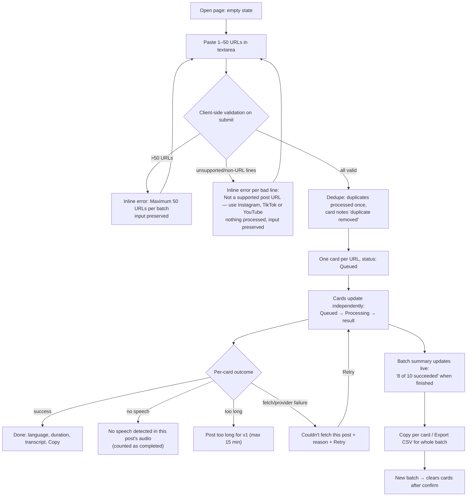

# Experience Spec — Influencer Transcript Translator (v1)

**Status:** Draft
**Date:** 2026-06-10
**Inputs:** `/product/03-definition/prd.md` (gate-approved), `/product/00-intake/request-brief.md`
**Designed on PRD working assumptions for OPEN-1..4 (see final OPEN list).**

## Executive summary
One desktop page, no login: a URL input box on top, result cards below. The user pastes 1–50 Instagram/TikTok/YouTube URLs, submits, and watches one card per URL move through queued → processing → done/failed independently. Each card shows the source link, platform, detected language, duration, status, and the English transcript with a copy button; failed cards show a plain-language reason and a retry. A batch summary line ("8 of 10 succeeded") and CSV export sit above the cards. Everything is keyboard-operable; card status changes are announced via a polite live region. Full WCAG 2.2 AA audit is deferred per NFR-8.

---

## 1. Design principles

1. **One page, one job.** Paste URLs, read English. No navigation, no modes, no settings.
2. **Per-post truth.** Every result is visibly tied to its source URL; a card never shows data that could belong to another post.
3. **Failure is a result, not a dead end.** Every failed card says what happened and what to do (retry / fix the URL / give up), and never harms the rest of the batch.
4. **Don't lose the user's input.** Pasted text survives validation errors; trimming a too-long list never means re-pasting.
5. **Buildable in a week.** Plain HTML/CSS/JS-compatible patterns only: textarea, buttons, cards, one live region. No design system, no custom widgets.

---

## 2. Layout options (diverge → converge)

| Option | Sketch | Verdict |
|---|---|---|
| **A — Input over results (stacked)** | Full-width input panel at top (textarea + submit), batch summary bar beneath it, vertical stack of result cards below. Input panel collapses to a slim one-line bar after submission with a "New batch" affordance to re-expand. | **Selected.** Matches the linear job (paste → watch → read), scrolls naturally for 50 cards, trivial in plain HTML, and reading a transcript gets full page width. |
| **B — Split pane (input left, results right)** | Persistent textarea in a left column (~35%), scrollable card list right. | Rejected: permanently spends a third of the width on an input that is idle 95% of the time; transcripts are long-form text and need width to be readable. |
| **C — Wizard (step 1 paste → step 2 results)** | Two sequential screens with a back step. | Rejected: adds navigation and state-management for zero benefit; hides the input during processing, making "add a corrected URL" or "start over" slower. Violates principle 1. |

Selection rationale in one line: A is the only option that gives transcripts full width, keeps input one keystroke away, and ships in plain HTML/CSS/JS within the appetite.

---

## 3. The user flow (single flow, covers ST-01..ST-04)



Step count for the core job: paste → submit → wait → read/copy = **4 steps**. Within budget.

Flow notes:
- Validation (ST-01/ST-02) is all-or-nothing at submit: if any line fails, nothing is sent, errors name the offending lines, input stays in the textarea (PRD: "my pasted input is preserved so I can trim it").
- "Unsupported platform" rejection happens at this same validation step — before any processing (ST-04).
- Retry (ST-04) reprocesses only that card from the failed step; the batch summary recalculates. Retried card returns to "Processing".
- ASSUMPTION: starting a new batch while one is processing is blocked (submit disabled until the batch finishes or the user confirms abandoning it). PRD is silent; this is the simplest safe behaviour for a 1-week build.

---

## 4. Screen spec — the one page

### Information architecture
One screen, no navigation. Regions top to bottom:

1. **Header** — product name + one-line purpose. Static.
2. **Input panel** — textarea, helper text, inline validation messages, **Submit button (the page's primary action)**.
3. **Batch summary bar** — progress/summary line + "Export CSV" button. Hidden until a batch exists.
4. **Results list** — one card per URL, in submitted order (ASSUMPTION: input order, not completion order, so the list maps to the user's pasted list).
5. **Live region** (visually hidden, `aria-live="polite"`) — announces card status changes and batch completion.

### Region: Input panel

| State | Behaviour & content |
|---|---|
| **Empty / first-run** | Textarea with label "Post URLs" and helper text: **"Paste Instagram, TikTok or YouTube post URLs, one per line"**. Counter "0 of 50". Submit button labelled "Get transcripts", disabled until the textarea is non-empty. No cards below. |
| **Loading / processing** | After successful submit, panel collapses to one line: "Processing batch — 'New batch' to start over". Textarea content cleared into the cards. Submit disabled (see flow note above). |
| **Partial / overflow** | >50 lines pasted: counter turns to "57 of 50" plus error text **"Maximum 50 URLs per batch"** under the textarea; submit blocked; input preserved. Duplicate lines: allowed at input; deduped at submit (noted on the card, not as an input error). |
| **Error** | One or more invalid lines: error block under the textarea listing each bad line with **"Not a supported post URL — use Instagram, TikTok or YouTube"**; nothing submitted; input preserved; first bad line described by `aria-describedby` on the textarea. |
| **Ideal** | Valid list pasted, counter shows "10 of 50", submit enabled. |

### Region: Batch summary bar

| State | Behaviour & content |
|---|---|
| **Empty / first-run** | Not rendered. |
| **Loading / processing** | "Processing 3 of 10 — 1 failed so far". Export CSV button disabled with reason in tooltip/title: "Available when the batch finishes". |
| **Partial** | Batch finished with mixed results: **"8 of 10 succeeded"** (no-speech posts count as completed per ST-04). Export CSV enabled — export includes failed rows with status `failed` and populated `error` column. |
| **Error** | All URLs failed: "0 of 10 succeeded". Export CSV still enabled (the error column is the value). |
| **Ideal** | "10 of 10 succeeded". Export CSV enabled. |

### Region: Results list

| State | Behaviour & content |
|---|---|
| **Empty / first-run** | Not rendered (the input helper text carries the first-run instruction; no placeholder illustrations — internal tool, 1-week appetite). |
| **Loading / processing** | One card per URL immediately on submit, each showing the URL and status "Queued", then "Processing…". Cards update independently (ST-02). |
| **Partial** | Mix of done/failed/no-speech cards. Order unchanged. Failed cards show reason + Retry. |
| **Error** | Single-URL submission that fails: one failed card with reason + Retry — same anatomy, no special case. |
| **Ideal** | All cards done, full transcripts visible. Long transcripts: card shows the full transcript as plain text; ASSUMPTION: transcripts longer than ~12 lines are collapsed behind "Show full transcript" to keep a 50-card page scannable. Copy always copies the full text. |

---

## 5. Result card anatomy

```
┌──────────────────────────────────────────────────────────────┐
│ [YouTube]  https://youtube.com/watch?v=…  (clickable, new tab)│  ← header row
│ Status: Done · Portuguese (Brazil) · 2 min 41 s               │  ← meta row
│──────────────────────────────────────────────────────────────│
│ English transcript (plain text, full width)                   │  ← body
│ …                                                             │
│──────────────────────────────────────────────────────────────│
│ [Copy transcript]                      (duplicate removed)    │  ← action row
└──────────────────────────────────────────────────────────────┘
```

Content priority order: status → source URL → transcript → metadata → actions.

| Element | Spec |
|---|---|
| Platform badge | Text badge "YouTube" / "TikTok" / "Instagram". Text label, never colour/icon alone. |
| Source URL | Clickable link, opens in new tab, full URL shown (truncated middle with title attribute holding full URL if too long). |
| Status | One human-readable word/phrase, always present: Queued / Processing… / Done / No speech detected / Failed (with reason below). Status conveyed by text + icon shape, never colour alone. |
| Detected language | Human-readable, e.g. "Portuguese (Brazil)". English-source posts: **"English (no translation applied)"** in place of the language label (ST-03). Absent until done. |
| Duration | "2 min 41 s". Absent until fetched. |
| Transcript | Plain text, preserves paragraph breaks if the provider supplies them. Empty transcript never shown — status becomes "No speech detected" (ST-03). |
| Copy button | "Copy transcript" → on success the button text changes to "Copied" for ~2 s (text change, not colour-only), and the live region announces "Transcript copied". Present only on Done cards. |
| Retry | "Retry" button on failed cards only. Reprocesses this URL from the failed step (ST-04); card returns to "Processing…". |
| Duplicate note | "duplicate removed" shown as a small note on the single surviving card when the input contained that URL more than once (ST-02). |

### Failed-card variants (exact statuses)

| Cause | Card status line | Detail line | Action |
|---|---|---|---|
| Unfetchable (private/deleted/geo-blocked/platform refused) | **"Couldn't fetch this post"** | Best-known reason, e.g. "post is private or removed" | Retry |
| Over length cap | **"Post too long for v1 (max 15 min)"** | "This post is 22 minutes. Shorter posts up to 15 minutes are supported." | none (retry won't help) |
| Provider error (STT/translation) | **"Couldn't fetch this post"** is **not** used — status: "Transcription failed" | "The transcription service returned an error — retrying usually fixes this." | Retry |
| No speech | **"No speech detected in this post's audio"** | — (counted as completed, not failed) | none |

---

## 6. Content design — microcopy table

Tone: plain, factual, sentence case, no blame, no jargon ("post", not "media asset"; "couldn't fetch", not "HTTP 403").

| Moment | Copy |
|---|---|
| First-run helper | Paste Instagram, TikTok or YouTube post URLs, one per line |
| Submit button | Get transcripts |
| Invalid line | Not a supported post URL — use Instagram, TikTok or YouTube |
| Over batch limit | Maximum 50 URLs per batch |
| Duplicate handling | duplicate removed |
| Queued / processing | Queued · Processing… |
| Batch progress | Processing 3 of 10 — 1 failed so far |
| Batch done, mixed | 8 of 10 succeeded |
| Unfetchable post | Couldn't fetch this post — post is private or removed. Retry, or open the link to check it still exists. |
| Provider failure | Transcription failed — the transcription service returned an error. Retrying usually fixes this. |
| Too long | Post too long for v1 (max 15 min) |
| No speech | No speech detected in this post's audio |
| English source | English (no translation applied) |
| Copy success | Copied (button) / "Transcript copied" (live region) |
| Export disabled | Available when the batch finishes |
| New batch over unfinished work (destructive) | Start a new batch? Current results will be cleared and can't be recovered. Export the CSV first if you need them. [Cancel] [Clear and start new batch] |

Destructive-action rule: clearing results is the only destructive action on the page; it always confirms and always reminds the user that CSV export is the escape hatch (no persistence per NFR-7).

---

## 7. Accessibility

Per NFR-8, the bar for v1 is **basic keyboard operability and visible labels; a full WCAG 2.2 AA audit is deferred**. What v1 must still do:

- **Keyboard path for the whole flow:** tab order = textarea → Get transcripts → Export CSV → each card (link → Copy/Retry → Show full transcript). Every action is a real `<button>` or `<a>`; no click-only divs. Ctrl/Cmd+Enter submits from the textarea.
- **Visible focus** on every interactive element (default browser outline acceptable; never `outline: none` without replacement).
- **Labels:** textarea has a programmatic label ("Post URLs"); validation errors linked via `aria-describedby`; buttons have text labels (no icon-only controls).
- **Status announcements:** one visually hidden `aria-live="polite"` region announces card status transitions ("URL 3: done", "URL 7: failed — couldn't fetch this post"), batch completion ("8 of 10 succeeded"), and copy confirmation. Cards themselves are not live regions (50 live regions would be noise).
- **No colour-only meaning:** status is always text; failed/done differentiation also carries a text prefix.
- **Target sizes:** buttons min 24×24 px (desktop-only tool); error identification in text adjacent to the field.
- Headings: page `<h1>`, each card heading is the source URL as an `<h2>`-level element for screen-reader navigation across 50 cards.

---

## 8. Heuristic self-review (Nielsen)

| Heuristic | Score | Note |
|---|---|---|
| Visibility of system status | Strong | Per-card status + batch progress + live region. |
| Match to real world | Strong | All statuses human-readable; platform names, not codes. |
| User control & freedom | Adequate | Retry per card; new-batch confirm. **Compromise:** no per-card or batch cancel during processing — out of PRD scope, flagged for "Later". |
| Consistency & standards | Strong | One card anatomy for all outcomes. |
| Error prevention | Strong | Validation before submit, input preserved, dedupe automatic. |
| Recognition over recall | Strong | Everything on one page; nothing hidden behind navigation. |
| Flexibility & efficiency | Adequate | Ctrl/Cmd+Enter submit; no other accelerators — acceptable at this appetite. |
| Aesthetic & minimalist | Strong | One primary action per screen state. |
| Error recovery | Strong | Every failure names the problem and the next step (ST-04). |
| Help & documentation | Adequate | Helper text only. No docs page — internal tool, acceptable. |

**Known compromises:** no cancel mid-batch; no transcript persistence (by PRD/NFR-7 — the CSV warning in the clear-confirm dialog mitigates); collapse threshold for long transcripts is an unevidenced ASSUMPTION.

---

## 9. ASSUMPTIONS made in this spec

- A-UX1: Cards render in input order, not completion order.
- A-UX2: Submitting a new batch while one is processing is blocked behind a confirm that clears current results.
- A-UX3: Transcripts longer than ~12 lines collapse behind "Show full transcript".
- A-UX4: Source links open in a new tab.
- A-UX5: All-or-nothing validation at submit (any invalid line blocks the whole submit) — inferred from ST-01 "nothing is sent for processing".

None of these block build; the implementer may adjust A-UX1/A-UX3 freely.

## 10. OPEN (for the user, via orchestrator)

No new blocking questions. This spec is designed on the PRD working assumptions for the existing open items, which all touch the design only lightly:

- **Q-002 (batch size):** the "50 of 50" counter and "Maximum 50 URLs per batch" copy change if the limit changes — copy is parameterised, not a redesign.
- **Q-004 (15-min cap):** the "Post too long for v1 (max 15 min)" copy is parameterised on the cap.
- Q-001 and Q-003 do not affect the UI.
