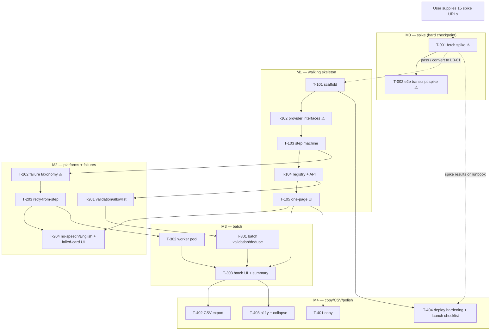

# Delivery Plan — Influencer Transcript Translator (v1)

**Status:** Draft
**Date:** 2026-06-10
**Inputs:** `/product/03-definition/prd.md` (gate-approved), `/product/04-design/experience-spec.md`, `/product/05-architecture/architecture.md` + ADR-001/002/003 (gate-approved), `/product/questions.md` (Q-001/Q-002/Q-004 open — planning on PRD working assumptions; Q-003 resolved: no-auth confirmed)

## Executive summary
Five milestones in one build week: a day-1 fetch spike (M0, hard checkpoint with ADR-001 thresholds and a defined fallback ladder), then four vertical slices matching the PRD's release ladder — walking skeleton (M1), three platforms + failure handling (M2), batch + summary + dedupe (M3), copy + CSV + polish (M4). If the build sandbox cannot reach the live platforms, the spike converts to a launch-blocking checklist item executed by the user, and the build runs against fixture media behind a provider interface. Honest sums say the full backlog is ~6.25 effort-days plus a 1-day hammock against a 5-day appetite — it only fits if the mid-week checkpoint stays green or the PRD's cut ladder (CSV → batch → third platform) fires. The single-URL YouTube transcript path is never cut. Product code is a standalone Next.js/TypeScript app in `/src`, never touching the repo-root dashboard.

---

## 1. Milestone 0 — Fetch spike (Day 1 morning, HARD CHECKPOINT)

The riskiest assumption in the product (PRD A1/A2, risk R1) is tested before anything else is built. Per ADR-001:

**What runs:** latest yt-dlp from a deployment-representative network against **15 recent real public URLs supplied by the user** (5 per platform), plus 3 fetched posts (one per platform, non-English) end-to-end through `whisper-1 /audio/translations`. Also verifies: 64 kbps mono m4a of a 15-min post stays <25 MB, and `verbose_json` returns the detected source language on the `/translations` endpoint. Records per-post cost and wall-clock time (A5, NFR-1 evidence).

**Pass thresholds:** YouTube **≥5/5**, TikTok **≥4/5**, Instagram **≥3/5**, all without cookies. Plus: user rates the 3 transcripts usable/not-usable (A2 early signal).

### Checkpoint decision table (per ADR-001 fallback ladder)

| Spike outcome | Action |
|---|---|
| All thresholds pass | Proceed as designed (ladder rung 1). M1 starts same day. |
| Instagram fails only | Continue building M1/M2 (YouTube + TikTok are alive). In parallel, orchestrator puts the choice to the user: **rung 2** (IG session cookies — requires explicit sign-off, deeper ToS breach, monthly cookie churn) or **rung 3** (manual file-upload escape hatch — PRD scope change, route back to product-manager for a v2 PRD line before building, ~half-day) or **rung 4** (ship two platforms, matching cut #3). Log in `/product/questions.md`. |
| TikTok fails (YouTube passes) | Same shape as Instagram-only failure: build continues on YouTube; user chooses rung 3 or rung 4 for TikTok (no cookie rung exists for TikTok in ADR-001). |
| YouTube fails, or two platforms fail | **STOP. Do not build around it silently.** Orchestrator escalates to the user with a kill/pivot recommendation. M1 does not start until the user decides. |
| Transcript quality: <2 of 3 rated usable | Build continues (skeleton is still needed to test further), but ADR-002's named upgrade path (`gpt-4o-transcribe` + `gpt-4o-mini` translation) is pre-positioned and the NFR-3 launch check becomes the deciding gate. |

### Sandbox contingency — stated explicitly
**If the implementation-engineer's build environment cannot reach YouTube/TikTok/Instagram (or the OpenAI API) at all, the spike cannot be executed during the build.** In that case:

1. The spike converts, unchanged in content and thresholds, into **launch-blocking checklist item LB-01**, executed by the user at release from the real deployment environment, using a runbook delivered in ticket T-404. The release-manager may not ship without LB-01 results recorded.
2. The build proceeds against **recorded/sample media fixtures** (short audio/video files committed as test assets) and **canned provider responses**, both served through the fetcher/transcriber interfaces built in T-102. Every slice stays testable offline.
3. The qa-engineer marks live fetch and live transcription as **NOT VERIFIED — deferred to LB-01** in the test report. The ADR-001 decision table above then applies at release time instead of day 1.
4. This contingency is recorded as risk RK-5 in the RAID log below.

ToS exposure for all three platforms was **explicitly accepted by the user at the Architecture gate** (2026-06-10) — the spike tests feasibility, not permission.

---

## 2. Milestone map

| # | Milestone | PRD slice | Demo statement ("at the end you can watch…") | Target |
|---|---|---|---|---|
| M0 | Fetch spike | A1/A2 kill-risk | The spike report: per-platform fetch success vs thresholds, 3 real transcripts, cost and timing per post. Or: the documented sandbox-blocked conversion to LB-01. | Day 1 AM |
| M1 | Walking skeleton | v0 (one platform) | One YouTube URL pasted into the deployed page → English transcript + detected language on a result card, temp media purged, cost line in the logs. Runs end-to-end with real provider calls **mocked behind an interface** (fixture mode) so the demo works offline; flips to real mode by env var where the network allows. | Day 2 EOD |
| M2 | Three platforms + failure states | v0 done (ST-01, ST-04) | TikTok and Instagram URLs work; a private/removed URL shows "Couldn't fetch this post" with a working Retry; a 22-minute post is rejected with the max-15-min message; a silent clip shows "No speech detected". | Day 3 EOD — **mid-week checkpoint** |
| M3 | Batch + summary + dedupe | v1 (ST-02) | 10 URLs pasted at once: cards update independently, a duplicate is collapsed with a note, 2 failures don't harm 8 successes, summary reads "8 of 10 succeeded". 51 URLs are blocked with input preserved. | Day 4 EOD |
| M4 | Copy + CSV + polish | v1 ship (ST-03) | Copy button per card; CSV download with failed rows populated; whole flow driven by keyboard; launch checklist (incl. LB-01 if deferred) handed to release-manager. | Day 5 EOD |

---

## 3. Ticket backlog

Sizes are relative: **S ≈ quarter-day, M ≈ half-day.** No ticket exceeds half a day. ⚠ = touches an unproven integration.

| ID | Story | Description | Acceptance criteria ref | Depends on | Size | Risk |
|---|---|---|---|---|---|---|
| **M0** | | | | | | |
| T-001 | A1/R1 | Spike harness: run yt-dlp against the 15 user-supplied URLs from a deployment-representative network; record per-platform success vs ADR-001 thresholds; verify 15-min/64 kbps <25 MB. If sandbox is network-blocked: document it, generate fixture assets, convert spike to LB-01. | ADR-001 spike items 1–2, 4 | user supplies URLs | M | ⚠ |
| T-002 | A2/A5 | End-to-end spike: 3 fetched posts through `/audio/translations` (`verbose_json`); confirm detected-language field; record cost + wall-clock per post; user rates transcripts usable/not. | ADR-001 spike item 3 | T-001, OPENAI_API_KEY | S | ⚠ |
| **M1** | | | | | | |
| T-101 | ST-01 | Scaffold standalone Next.js + TS app in `/src`: own `package.json` + lockfile, zero imports across the root-app boundary, Dockerfile (`node:22-slim` + ffmpeg + pinned yt-dlp), `/api/health` (tmp writable, key present, yt-dlp `--version`), startup log line stating the single-instance constraint. | ADR-003; arch §12–13 | — | M | |
| T-102 | ST-01 | `Fetcher` and `Transcriber` interfaces with two implementations each: real (yt-dlp spawn with argv arrays; OpenAI HTTPS) and fixture (sample media files / canned `verbose_json`), selected by env var. This is what keeps every later slice testable offline. | arch §3–4; M0 contingency | T-101 | S | ⚠ |
| T-103 | ST-01 | Per-item step machine FETCH → EXTRACT → TRANSCRIBE_TRANSLATE → DONE for a single item: per-item temp dir, purge on completion, JSON-line logs with step timings, `costUsd = ceil(durationMin) × 0.006`. | arch §4, §8; NFR-6/7/9 | T-102 | M | |
| T-104 | ST-01 | In-memory batch registry (`Map`, 24 h TTL eviction) + `POST /api/batches` (single YouTube URL accepted) + `GET /api/batches/:id` (no `audioPath` leak). | arch §6–7 | T-103 | S | |
| T-105 | ST-01 | The one page: labelled textarea + helper text + "Get transcripts" button, one result card (anatomy per experience spec §5), 2 s polling that stops when settled, `aria-live` polite region. All five states (empty / loading / partial / error / ideal) for input panel + card. | ST-01 Gherkin; UX §4–5 | T-104 | M | |
| **M2** | | | | | | |
| T-201 | ST-01/04 | VALIDATE step for all three platforms: hostname allowlist (exact list from arch §10), `new URL()` parse, reject userinfo/IP-literal/non-https, unsupported-platform inline rejection before processing, input preserved on error. | ST-01 invalid-input; ST-04 unsupported; threat #1–2 | T-104 | S | |
| T-202 | ST-04 | yt-dlp stderr → failure taxonomy (`private_or_removed`, `geo_blocked`, `login_required`, `rate_limited`, `extractor_error`, `too_long`, `unknown`); 15-min cap rejection; >24 MB mono-48 kbps re-encode safety net; raw stderr to logs only. | ST-04 unfetchable; NFR-1/6; arch §9 | T-103 | M | ⚠ |
| T-203 | ST-04 | Retry-from-failed-step: `POST .../retry` (409 if not failed), `lastCompletedStep` resume, 60-min failed-audio retention, sweeper at startup + every 10 min, transparent restart-from-FETCH if artifact purged. | ST-04 transient-failure; arch §4, §8 | T-202 | M | |
| T-204 | ST-03/04 | `no_speech` status (empty/whitespace transcript → completed, not failed); "English (no translation applied)" label; OpenAI timeout 120 s + 2 jittered retries in-step; failed-card UI variants with exact statuses + Retry button + live-region announcements per UX §5–6. | ST-03 empty/English; ST-04 no-speech | T-203, T-105 | S | |
| **M3** | | | | | | |
| T-301 | ST-02 | Batch validation: ≤50 cap with "Maximum 50 URLs per batch" and preserved input, all-or-nothing submit (any bad line blocks all, per-line errors), dedupe with "duplicate removed" note on the surviving card. | ST-02 limit/duplicates; UX A-UX5 | T-201 | S | |
| T-302 | ST-02 | Worker pool: global concurrency 4, fair FIFO across batches, max 3 live batches → 429 "Server busy", per-item isolation (one failure never touches siblings). | ST-02 partial-failure; arch §5; NFR-2/5 | T-203 | S | |
| T-303 | ST-02 | Batch UI: one card per URL in input order updating independently, summary bar ("Processing 3 of 10 — 1 failed so far" → "8 of 10 succeeded"; no-speech counts as completed), new-batch destructive confirm with CSV reminder, counter "n of 50". Verify a 50-fixture batch settles within the NFR-2 budget in fixture mode. | ST-02 happy/partial; UX §4, §6 | T-301, T-302, T-105 | M | |
| **M4** | | | | | | |
| T-401 | ST-03 | "Copy transcript" button: clipboard write, "Copied" text-swap ~2 s, live-region "Transcript copied", present on Done cards only, copies full text even when collapsed. | ST-03 happy | T-105 | S | |
| T-402 | ST-03 | `GET /api/batches/:id/export.csv`: columns `url,platform,status,detected_language,transcript,error`; failed rows populated; formula-injection prefix guard; UI button disabled until batch settles ("Available when the batch finishes"). | ST-03 export | T-303 | S | |
| T-403 | NFR-8 | Accessibility + readability pass: full keyboard path (tab order per UX §7), Ctrl/Cmd+Enter submit, visible focus, `aria-describedby` on errors, no colour-only meaning, >~12-line transcript collapse behind "Show full transcript", `X-Robots-Tag: noindex`. | UX §4 ideal, §7 | T-303 (or T-204 if M3 cut) | S | |
| T-404 | release | Deploy hardening + launch handoff: README (single-instance constraint, dev hot-reload state loss, yt-dlp rebuild path), env validation at boot, min=max=1 deployment note, launch-blocking checklist for release-manager — **LB-01 spike runbook (if M0 was sandbox-blocked)** + NFR-3 ten-post accuracy-check materials + NFR-4 reachability check. | arch §12–13; ADR-001/003 consequences | T-101; content from T-001 | S | ⚠ |

---

## 4. Dependency graph

Critical path: T-001 → T-101 → T-102 → T-103 → T-104 → T-105 (skeleton), then T-202 → T-203 → T-204. M3 and M4 hang off it and are exactly the PRD's cuttable layers.

---

## 5. Appetite reconciliation

Appetite: **≤1 week of build effort** (taken as 5 effort-days).

| Milestone | Tickets | Sum |
|---|---|---|
| M0 | 1 M + 1 S | 0.75 d |
| M1 | 3 M + 2 S | 2.00 d |
| M2 | 2 M + 2 S | 1.50 d |
| M3 | 1 M + 2 S | 1.00 d |
| M4 | 4 S | 1.00 d |
| **Backlog total** | | **6.25 d** |
| Hammock (~15% for the unknowns that always appear) | | **+1.00 d** |
| **Plan total** | | **7.25 d vs 5.0 d appetite — over by ~2.25 d** |

This plan does **not** show everything finishing comfortably on time, because it wouldn't be true. The squeeze points, named:

1. **Day 1 is double-booked** (spike + scaffold). If the spike drags past noon, M1 slips half a day immediately.
2. **T-202 (failure taxonomy)** is calibrated against live yt-dlp stderr; in fixture mode it's built from documented error strings and may need a second pass after LB-01.
3. **M3 + M4 (2.0 d) only fit if M0–M2 land on schedule and the hammock stays mostly unspent.**

**Resolution — the PRD's cut-first ladder, pre-wired (not optimism):**

| Cut (in order) | What ships instead | Saves |
|---|---|---|
| 1. CSV export (T-402) | Copy-per-card only | 0.25 d |
| 2. Batch input (all of M3) | Single-URL tool; submit one URL at a time | 1.00 d |
| 3. Third platform (Instagram paths in T-201/T-202) | YouTube + TikTok | ~0.50 d |
| **Floor** | Single YouTube URL → transcript. **Never cut.** | |

Full ladder fired: 6.25 − 1.75 = 4.5 d + reduced hammock ≈ appetite. So the week holds at every rung; what flexes is scope, per Shape Up.

### Mid-week checkpoint (end of Day 3, after the M2 demo)
The orchestrator assesses and records the decision in `/product/changelog.md`:

| State at Day 3 EOD | Decision |
|---|---|
| M2 demo done, hammock ≥ half intact | Build M3 + M4 in full. |
| M2 done but ~0.5 d behind | Fire cut 1 (CSV). Build M3 + remaining M4. |
| M2 done but ~1 d behind | Fire cuts 1 + 2 (CSV + batch). T-403/T-404 still ship; T-403 re-pointed at the single-card UI. |
| M2 not done / a platform integration is failing | Fire cut 3 (ship two platforms) and/or invoke the ADR-001 ladder via the orchestrator; re-slice the remainder of the week explicitly — no silent scope absorption. |

---

## 6. Definition of Done (project-wide)

A ticket is done when **all** of the following hold (tailored: no staging environment exists per architecture §12 — the built Docker image run locally is the stand-in):

1. Acceptance criteria met, traced to the referenced ST-xx Gherkin scenario or NFR/architecture section.
2. Tests written and passing: unit tests for pure logic (validation, taxonomy mapping, dedupe, CSV escaping, cost calc), integration tests through the fixture adapters for pipeline tickets. Fixture mode means no test needs the live network.
3. Five UI states handled (empty / loading / partial / error / ideal) for any ticket that touches the page — per the experience-spec state tables.
4. No silent deviations from the PRD or experience spec: any forced deviation is routed back through the orchestrator to the owning agent and logged in `/product/changelog.md`.
5. NFR mapping noted in the ticket close-out (which NFRs this ticket serves; NFR-6 logging and NFR-7 purge verified wherever the pipeline is touched).
6. Code reviewed (self-review pass against this DoD recorded in `/product/07-build/build-log.md` if no second engineer).
7. `docker build` of `/src` succeeds and the app boots end-to-end in fixture mode; root dashboard app untouched (no shared lockfile, no cross-imports).
8. Docs current: README and build log updated.

---

## 7. RAID log

Owners: IE = implementation-engineer, RM = release-manager, ORC = orchestrator, USER = requester (dcemjones).

### Risks

| ID | Risk | Likelihood / impact | Mitigation | Owner | Review |
|---|---|---|---|---|---|
| RK-1 | (PRD R1) Media fetch breaks or is blocked — extractor breakage, IP blocks, IG login-walls. **ToS exposure for all three platforms explicitly accepted by USER at the Architecture gate (2026-06-10).** Residual risk is operational, not approval. | High / High — kill-risk | M0 spike thresholds + ADR-001 fallback ladder; failure UX is first-class (ST-04); ~0.5 d/month rebuild budget post-launch | IE (technical), USER (business risk, accepted) | M0 checkpoint; LB-01 if deferred |
| RK-2 | (PRD R2) whisper-1 accuracy fails the "readable enough" bar in the languages that matter (Q-001 open). | Med / High | 3-transcript early signal in M0; NFR-3 ten-post launch check (launch-blocking, materials in T-404); ADR-002 named upgrade path (~half-day, same vendor) | USER rates, IE executes | Pre-launch |
| RK-3 | (PRD R3) Per-transcript cost surprises at real volume (Q-002 open). | Low / Med | $0.006/min verified; ≈$25–40/mo projection; `costUsd` logged per item (NFR-9); hard caps bound worst case at $4.50/batch | IE | Retro, with real logs |
| RK-4 | **Single-instance fragility:** in-memory state means a crash/restart loses in-flight batches; a future second instance or serverless deploy breaks retry, polling and purge *silently*; `next dev` recycles state during development. | Med / Med | Accepted at Architecture gate; min=max=1 deploy note, startup warning log and README (T-404, T-101); UI shows "batch no longer available — resubmit" on 404 | IE build, RM deploy | M4 / launch |
| RK-5 | **Sandbox cannot reach live platforms or OpenAI** — spike unexecutable during build. | Unknown until Day 1 / High if unmanaged | The §1 contingency: spike → LB-01 launch-blocking item run by USER; build on fixtures via T-102 interfaces; QA marks live paths NOT VERIFIED | IE detects, RM enforces LB-01, USER executes | Day 1; release gate |
| RK-6 | `verbose_json` on `/translations` may not return the detected-language field (ADR-002 ASSUMPTION). | Low / Low | Verified in M0 (or LB-01); fallback already designed: display "auto-detected" or one cheap labelling call | IE | M0 |
| RK-7 | T-202's stderr→taxonomy mapping built blind in fixture mode may misclassify real failures. | Med / Low | Taxonomy table from ADR docs; `unknown` is a safe default; recalibration pass scoped inside LB-01 follow-up | IE | LB-01 |

### Assumptions (all labelled ASSUMPTION; carried, not new)

| ID | Assumption | Source | If wrong |
|---|---|---|---|
| AS-1 | ASSUMPTION: ≤50 URLs/batch, low-tens of batches/month (Q-002 open). | PRD NFR-2 | Copy + cap are parameterised; >~500 URLs/day forces pool/cost revisit (arch OPEN) |
| AS-2 | ASSUMPTION: 15-min post cap acceptable (Q-004 open). | PRD NFR-1 | Cap copy parameterised; >~45 min forces unbudgeted audio chunking |
| AS-3 | ASSUMPTION: priority languages = ES/PT/FR/DE/JA/KO/ID (Q-001 open). | PRD OPEN-1 | Changes the NFR-3 test set, maybe triggers ADR-002 upgrade path; no structural change |
| AS-4 | ASSUMPTION: 64 kbps mono m4a keeps a 15-min post <25 MB; whisper runs faster than real time; 4 workers meet the 30-min batch budget. | arch §4–5 | M0/LB-01 verifies; re-encode safety net (T-202) and pool tuning absorb misses |
| AS-5 | ASSUMPTION: USER can supply 15 recent real post URLs and rate transcripts within Day 1 (or at LB-01). | ADR-001 spike | Spike slips → whole plan slips day-for-day; see Issues IS-1 |

### Issues

| ID | Issue | Status | Owner | Raised |
|---|---|---|---|---|
| IS-1 | The 15 spike URLs (5 per platform, recent, public, incl. non-English) have not yet been supplied by the user. Blocks T-001 — or LB-01 if deferred. | Open | USER (ORC to chase via `/product/questions.md`) | 2026-06-10 |

### Dependencies

| ID | Dependency | Needed by | Owner | Status |
|---|---|---|---|---|
| DP-1 | `OPENAI_API_KEY` provisioned and available as an env secret (never logged). | T-002 (Day 1); real-mode testing thereafter | USER/RM | Open |
| DP-2 | `yt-dlp` (pinned static binary) + `ffmpeg` baked into the deploy image; rebuild path documented. | T-101 (Day 1) | IE | Planned (T-101) |
| DP-3 | Deploy target supporting one always-on instance (min=max=1), internal network or unguessable URL + noindex (NFR-4; Q-003 resolved: no-auth confirmed on this basis). | Launch | RM/USER | Open |
| DP-4 | USER time at release: execute LB-01 (if deferred) and the NFR-3 ten-post accuracy rating. | Release gate | USER | Open |

---

## 8. QA handoff note (for qa-engineer, Stage 8)

Verify per milestone, tracing every check to the ST-01..04 Gherkin scenarios in the PRD. Fixture mode makes all of this runnable offline; anything requiring the live network is explicitly split out.

| Milestone | Verify | Traceability |
|---|---|---|
| M1 | Single YouTube URL happy path end-to-end in fixture mode (card shows URL, platform, detected language, transcript); first-run empty state; temp dir purged after completion; `costUsd` + step timings in JSON logs; `/api/health`; app boots from the built Docker image; zero coupling to root app. | ST-01 happy + empty-state; NFR-6/7/9 |
| M2 | Invalid/unsupported input rejected inline with input preserved and nothing processed; each failed-card variant shows the exact status copy from the experience spec (§5 table); Retry resumes from the failed step (verify via logs that FETCH is not repeated after a TRANSCRIBE failure); >15-min post rejected; no-speech counted as completed; English-source labelling; allowlist blocks IP-literals/userinfo/non-https (SSRF). | ST-01 invalid-input; ST-04 all four scenarios; threat #1–2 |
| M3 | 10-URL fixture batch: independent card updates in input order, partial failure leaves successes untouched, summary "8 of 10 succeeded"; 51 URLs blocked with preserved input; duplicate processed once with note; 4-way concurrency observed; 4th simultaneous batch → 429; 50-item fixture batch settles within the NFR-2 budget. | ST-02 all four scenarios; NFR-2/5 |
| M4 | Copy button copies full transcript (incl. collapsed) with "Copied" feedback; CSV columns exact (`url,platform,status,detected_language,transcript,error`), failed rows populated, formula-prefix escaping, export disabled until settled; full keyboard path + visible focus + live-region announcements; new-batch destructive confirm. | ST-03 all four scenarios; NFR-8 |
| Cross-cutting | Five UI states per region against the experience-spec state tables; no PII in logs; restart loses in-flight batch → UI shows the resubmit message (accepted behaviour, verify the message, not absence of loss). | UX §4; NFR-6/7 |
| **Live-network items** | If M0 ran: confirm spike evidence is in the build log. If deferred: mark live fetch, live transcription, real stderr taxonomy and NFR-1 wall-clock timings as **NOT VERIFIED — launch-blocking checklist LB-01**, and confirm T-404's runbook exists and is executable by a non-engineer. NFR-3 accuracy check is the user's pre-launch task either way. | ADR-001; NFR-1/3 |

Anything QA finds that contradicts the PRD or experience spec routes back through the orchestrator to the owning agent — no silent patching.
